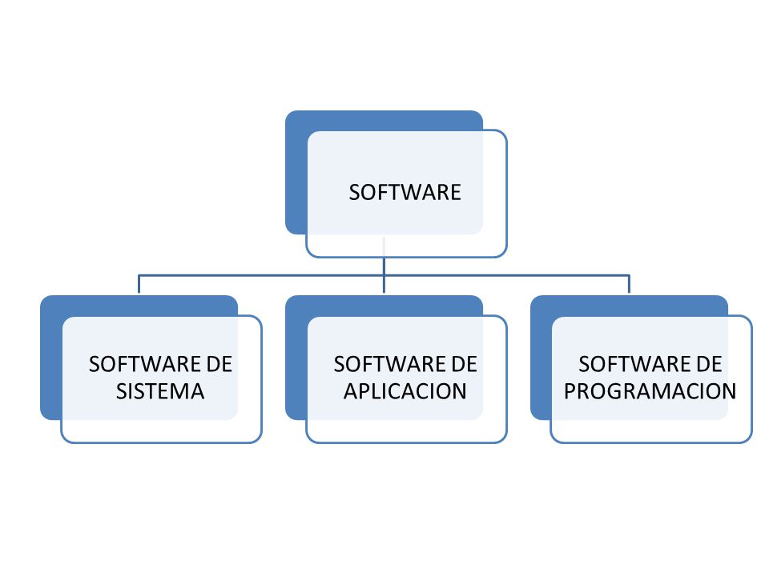

# Apuntes UF1 - 1

### Clasificaciones del software

- De sistema
    -  Sistema operativo
    -  Drivers
    -  ...
- De aplicación
    - Suite ofimática
    - Navegador web
    - Editor de imagenes
    - ...
- De desarrollo
    - Compiladores
    - Interpretes
    - ...

### Relación Hardware-Software

- _**Disco Duro**_:  almacena de forma permanente los archivos ejecutables y los archivos de datos.
- _**Memoria RAM**_:  almacena de forma temporal el código binario de los archivos ejecutables y los archivos de datos necesarios.
- _**CPU**_:  lee y ejecuta instrucciones almacenadas en memoria RAM, así como los datos necesarios.
- _**E/S**_:  recoge nuevos datos desde la entrada, se muestran los resultados, se leen/guardan a disco, ...

### Tipos de códigos

- _**Código fuente**_: Es un archivo de texto que es legible por quien los escribe, en concreto por un lenguaje de programación.
- _**Código objeto**_: Es un archivo que se crea para traducir el codigo fuente a binario.
- _**Código ejecutable**_: Es un archivo que se crea y nos permite ejecutar el programa.

### Fases principales del desarollo de software

- _**Análisis**_: Se encarga de analizar la idea, para saber si es programable y si va a ser viable. 
- _**Diseño**_: Se encarga de organizar y diseñar la idea.
- _**Codificación**_: Se encarga de escribir el código fuente.
- _**Pruebas**_: Se encarga de hacer pruebas para saber que se debe corregir.
- _**Mantenimiento**_: Se encarga de solucionar los problemas o errores que haya.

### Modelos de desarrollo de software

- Modelos clásicos (predictivos)
    - Modelo en cascada 
    - Modelo en V 
- Modelo de construcción de prototipos
- Modelos evolutivos o incrementales
    - Modelo en espiral (iterativos)
    - Metodologías ágiles (adaptativos)
